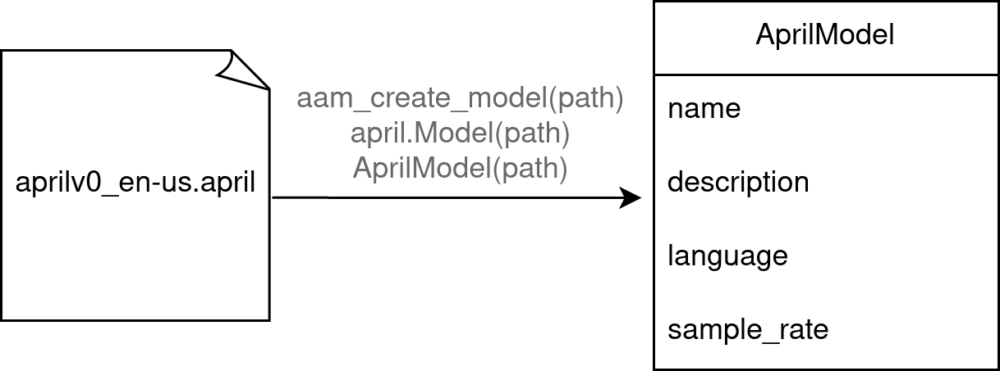
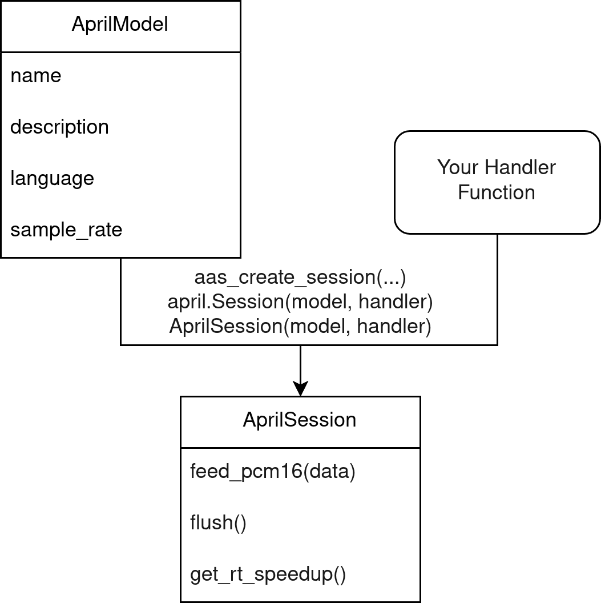
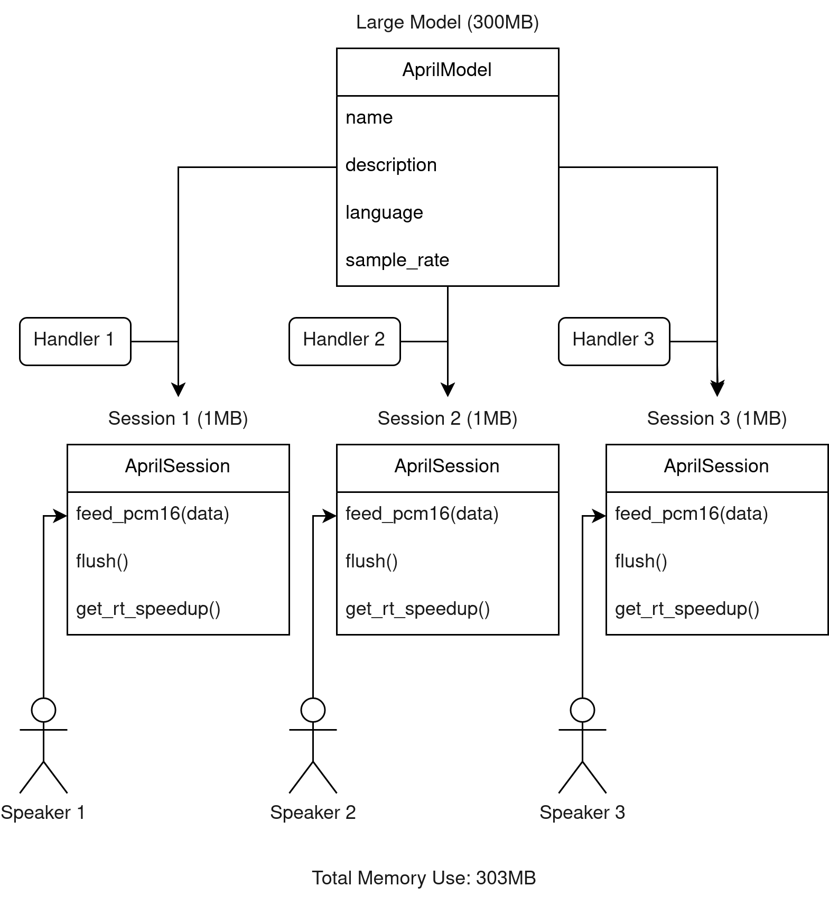
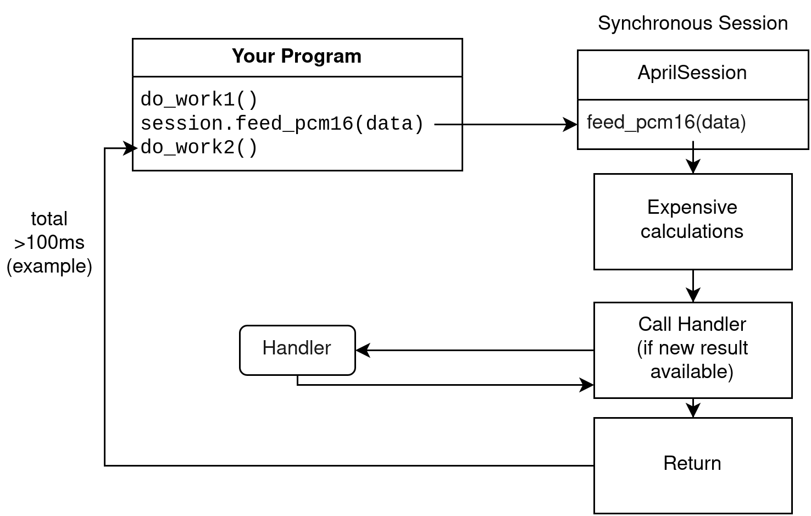
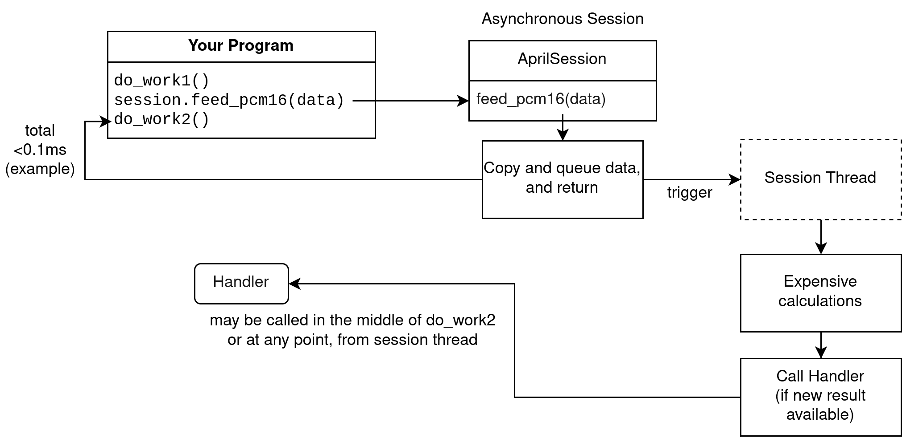
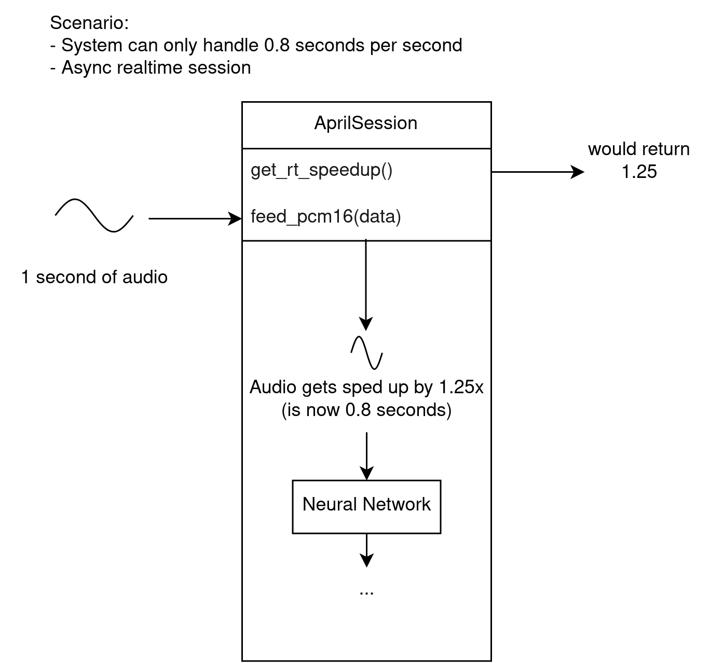

# General Concepts

Before writing any code, it's recommended to understand these concepts. These apply to all of the language bindings.

## Model

Models end with the file extension `.april`. You can load these files using the AprilASR API.

Each model has its own sample rate in which it expects audio. There is a method to get the expected sample rate. Usually, this is 16000 Hz.

Models also have additional metadata such as name, description, language.

After loading a model, you can create one or more sessions that use the model.

## Session

In the most common case, you will have one session based on one model.

The session is what performs the actual recognition. It has the functions to input audio, and it calls the handler with decoded results.

<!--(This feature is not yet implemented) When creating a session, you may specify a speaker ID or name. If not empty, this may be used to save and restore the hidden state, to help initialize the session in a way it can provide more accurate results instantly for a particular speaker. -->

### Decoding

To perform speech-to-text, feed PCM16 audio of the speech to the session through the `feed_pcm16` method (or equivalent in the language). Make sure it's in the correct sample rate and mono.

PCM16 means array of shorts with values between -32768 to 32767, each one describing one sample.

After calling `feed_pcm16`, the session will invoke the neural network and call your specified handler with a result. You can present this result to the user or do whatever you want with the result.

### Multiple sessions

In more advanced use cases, you may have multiple sessions performing recognition on multiple separate audio streams. When doing this, you can re-use the same model to minimize the memory use.

### Async vs Non-Async

#### Synchronous session (default)

The simplest (and default) mode of operation are synchronous sessions.

In a synchronous session, when you call the function to feed audio, it will process the audio synchronously, call the handler if a new result is decoded, and finally return once it's done.

This means that calls to feed audio are extremely slow. This may be undesirable in some cases, such as in a live captioning situation. For this reason, you can choose to construct asynchronous sessions instead.

#### Asynchronous session

An asynchronous session does not perform calculations on the calling thread.

Calls to feed audio are quick, as it copies the data and triggers a second thread to do the actual calculations. The second thread calls the handler at some point, when processing is done.

A caveat is that you must feed audio at a rate that comes out to 1 second per second. You should not feed multiple seconds or minutes at once. The internal buffer cannot fit more than a few seconds.

Asynchronous sessions are intended for streaming audio as it comes in, for live captioning for example. If you feed more than 1 second every second, you will get poor results (if any).

### Async-Realtime vs Async-Non-Realtime

In an asynchronous session, there is a problem that the system may not be fast enough to process audio at the rate that it's coming in. This is where realtime and non-realtime sessions differ in behavior.

A realtime session will work around this by automatically deciding to speed up incoming audio to a rate where the system can keep up. This involves some audio processing code, which may or may not be desirable.

Speeding up audio may reduce accuracy. It may not be severe at small values (such as 1.2x), but at larger values (such as over 2.0x) the accuracy may be severely impacted. There is a method you can call to get the current speedup value to know when this is happening, so you can display a warning to the user or similar.

A non-realtime session ignores this problem and assumes the system is fast enough. If this is not the case, the results will fall behind, the internal buffer will get full, `ErrorCantKeepUp` result will be called, and the results will be disastrously horrible.

## Handler

The results are given via a callback (handler). It gets called by the session whenever it has new results. The parameters given to the callback include the result type and the token array.

Note that in an asynchronous session, the handler will be called from a different thread. Be sure to expect this and write thread-safe code, or use a synchronous session.

You should try to make your handler function fast to avoid slowing down the session.

The actual text can be extracted from the token array.

### Result Type

The handler gets called with an enum explaining the result type:
* Partial Recognition - the token array is a partial result and an updated array will be given in the next call
* Final Recognition - the token array is final, the next call will start from an empty array
* Error Can't Keep Up - called in an asynchronous non-realtime session if the system is not fast enough, may also be called briefly in an asynchronous realtime session, the token array is empty or null
* Silence - there has been silence, the token array is empty or null

## Token

A token may be a single letter, a word chunk, an entire word, punctuation, or other arbitrary set of characters.

To convert a token array to a string, simply concatenate the strings from each token. You don't need to add spaces between tokens, the tokens contain their own formatting.

For example, the text `"THAT'S COOL ELEPHANTS"` may be represented as tokens like so:
* `[" THAT", "'", "S", " CO", "OL", " E", "LE", "P", "H", "ANT", "S"]`
* Simply concatenating these strings will give you the correct `" THAT'S COOL ELEPHANTS"`, but with an extra space at the beginning. You may want to strip the final string to avoid the extra space.

Tokens contain more data than just the string however. They also contain the log probability, and a boolean denoting whether or not it's a word boundary. In English, the word boundary value is equivalent to checking if the first character is a space.

## Dependencies

AprilASR depends on ONNXRuntime for ML inference. You will need both libraries for it to work:
* Linux: `libaprilasr.so` and `libonnxruntime.so`
* Windows: `libaprilasr.dll` and `onnxruntime.dll`